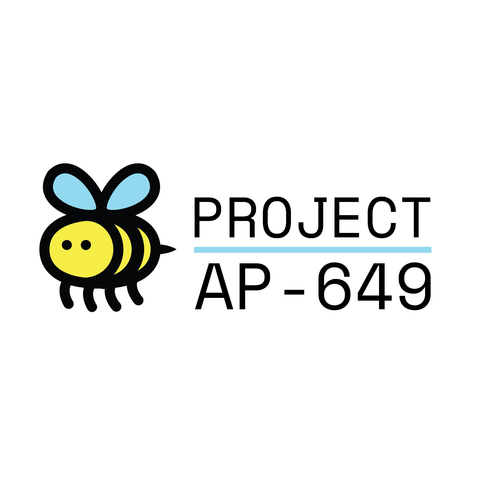

# 

    

Web application for the front end of Project AP649. An interaction design project. 

Project AP649 is an interactive sensor that visualizes physics concepts. Created to stimulate skillsets such as problem solving, curiosity, and interaction amongst young people.

The product is a bluetooth enabled sensor module that sends accelerometer data to a visual display in order to help users visualize changes in acceleration during interaction. With further development AP649's visualization can utilize more data inputs from its 9 degrees of freedom sensor. Using this information would allow AP649 to visualize more physics concepts such as motion and impact.

Currently AP649 only uses acceleration and magnetometer data.

Overall, velo is an interactive children's toy that aims to encourage learning through creation from play.

    

